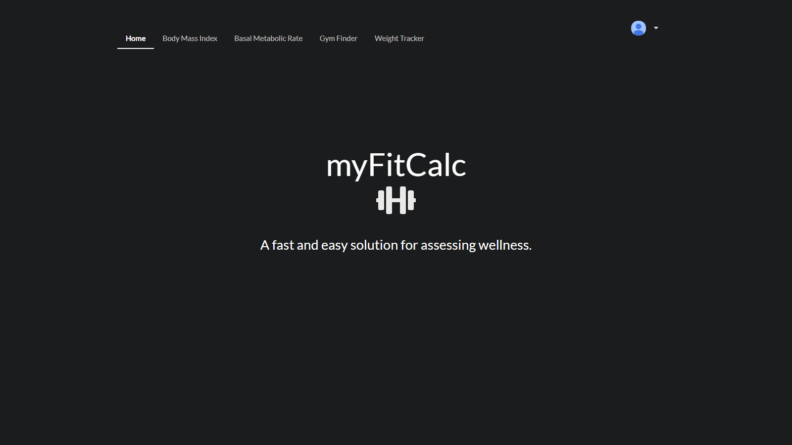
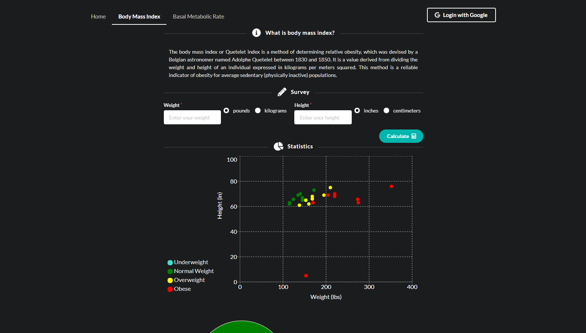
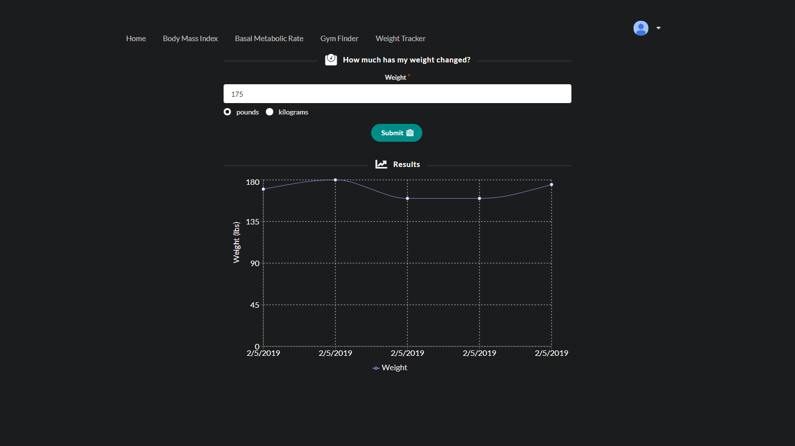

# myFitCalc
A calculator for determining and tracking fitness level using React.

## Screenshots




 ## Tech/framework used
React, Mongoose/MongoDB, React-Google-Login, Semantic-UI-React, Express, Node.js, Moment.js, Axios, Recharts, FontAwesome, Google-Maps-React

 ## Installation
If you want to try it out locally, fork the repo, clone your forked repository, and run the following in the terminal of the root directory:
```sh
yarn install && yarn start
```

 ## Contribute
If you would like to contribute, please open an issue or submit a pull request.

 ## Author
**Zacharias George Miles**